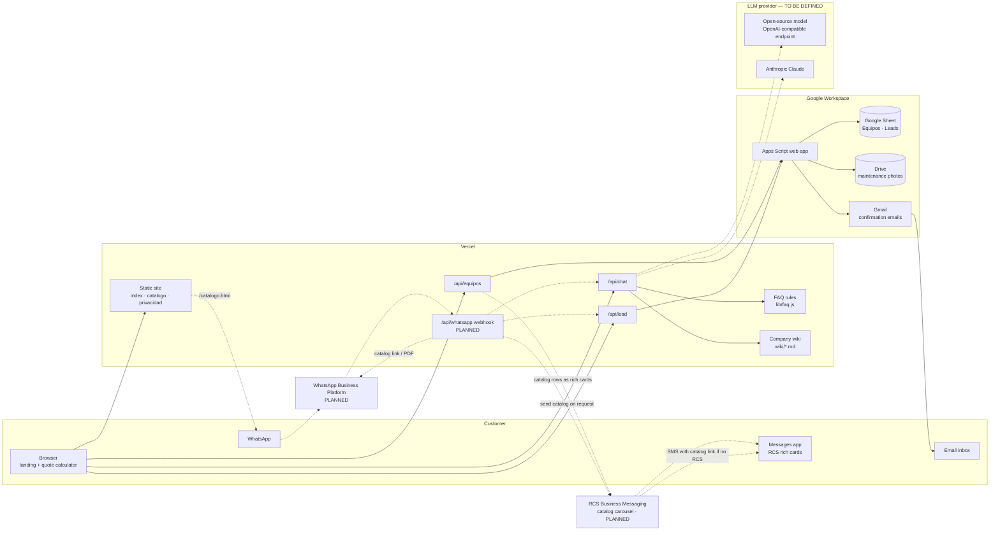
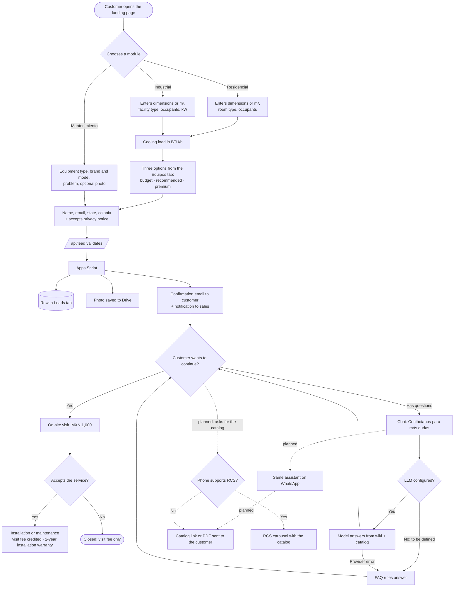

# Architecture

Solid lines are built and deployed. Dashed lines are **planned** (not implemented yet) and are drawn so the design leaves room for them.

## Block diagram

| Block | Status | Notes |
|---|---|---|
| Static site, `/api/equipos`, `/api/lead` | Built | No dependencies |
| Apps Script + Sheet + Drive + Gmail | Built | `apps-script/Code.gs`; selected sheet set with `SHEET_ID` |
| Chat with FAQ rules | Built | Default while `LLM_PROVIDER=none` |
| LLM provider | To be defined | Switch with env vars only; FAQ stays as fallback if the model fails |
| Shareable catalog | Built | `/catalogo.html`, filter with `?segmento=Residencial`, prints to PDF |
| RCS catalog | Planned | Rich-card carousel built from the `Equipos` tab (photo, BTU, average price, "Cotizar" button), sent when staff or the assistant decide it is needed. Requires a verified RCS business agent through an aggregator or carrier; falls back to SMS with the `/catalogo.html` link on phones without RCS |
| WhatsApp channel | Planned | Needs a Meta Business account, a verified number and approved message templates |

### WhatsApp migration path

1. **Now:** staff share the `/catalogo.html` link (or its PDF) in WhatsApp chats by hand.
2. **Next:** add `/api/whatsapp` as the webhook of the WhatsApp Business Platform (Cloud API). Incoming messages reuse the same brain as the web chat (`/api/chat` logic) and the same lead storage (`/api/lead` logic), so there is one source of truth.
3. **Later:** send the quote confirmation and the catalog as template messages, and sync the `Equipos` tab to the WhatsApp Business catalog.

## Flow diagram

