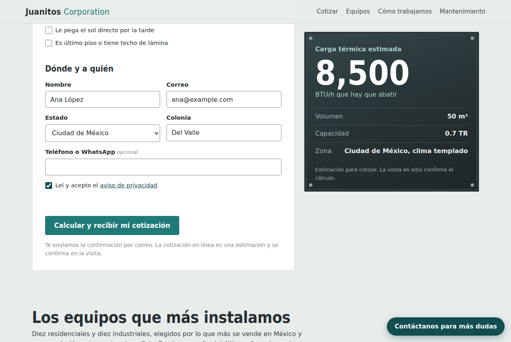
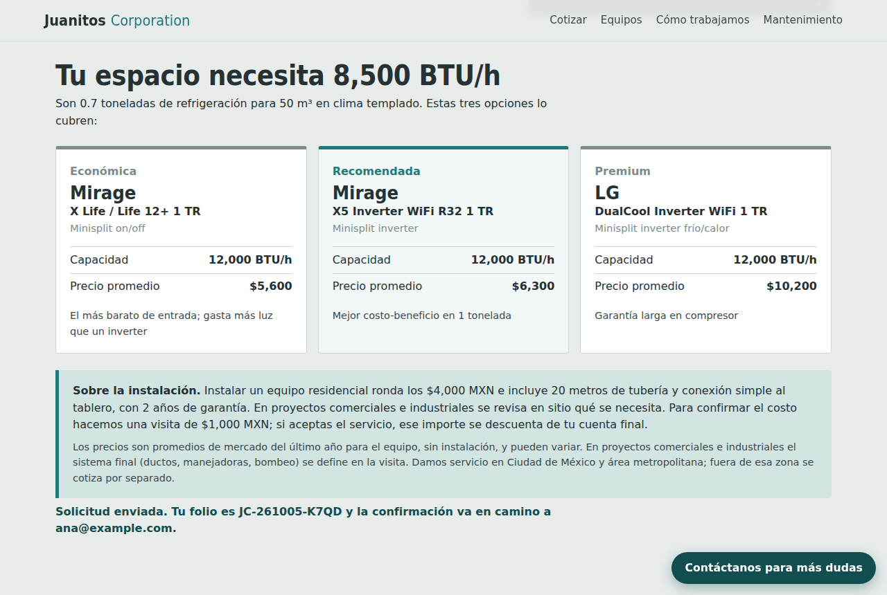
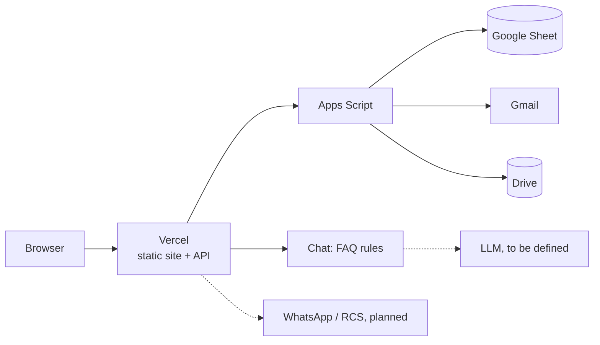

# Juanitos Corporation — HVAC Quote Calculator

A lead-generation site for an air-conditioning company in Mexico City. Visitors enter the size of a room or facility, get the cooling load in BTU/h, and receive three priced equipment options by email. Every request lands in a Google Sheet the sales team already uses.

**Live demo:** _add your Vercel URL here_





## What it does

- **Sizes the equipment before selling it.** Residential and commercial/industrial modules estimate the cooling load from volume, climate zone by state, occupancy and heat sources, then pick budget, recommended and premium options from the catalog.
- **Takes maintenance requests** with brand, model, fault description and an optional photo, resized in the browser before upload.
- **Lets non-developers run it.** Prices and equipment live in a Google Sheet; sales staff can resend any quote from a menu inside the sheet.
- **Confirms by email** to the customer and notifies the sales inbox.
- **Answers questions in a chat** with a swappable brain: keyword rules today, an open-source model or Claude later by changing environment variables.

## Engineering decisions

| Decision | Why |
|---|---|
| No framework, no build step, zero npm dependencies | The page is one form and one table; fewer moving parts means nothing to patch and instant deploys |
| Google Sheets + Apps Script as the back office | The client already works in Sheets; Apps Script gives storage, email and file uploads without extra accounts or cost |
| Serverless functions between the browser and Apps Script | Keeps the script URL and shared token out of client code, validates input and blocks spreadsheet formula injection |
| Bundled catalog fallback | The calculator keeps working if the sheet is unreachable |
| Pluggable LLM provider with a rule-based fallback | The chat never goes dark and the model can change without touching code |
| Planned channels drawn into the architecture | WhatsApp and an RCS catalog are designed for but not built; see the diagrams |



Full block and flow diagrams: [`docs/ARCHITECTURE.md`](docs/ARCHITECTURE.md).

## Modules

| Module | What the visitor provides | What they get |
|---|---|---|
| Residencial | Dimensions, room type, occupants, sun / roof exposure | BTU/h + 3 residential units |
| Industrial y comercial | Dimensions, facility type (pharma, auditorium, TV studio, offices…), occupants, equipment kW | BTU/h + 3 commercial systems |
| Mantenimiento | Residential or industrial, brand/model, problem, optional photo | Service ticket |

All modules collect name, email, state and neighborhood (colonia); phone is optional.

## Stack

- Static front end (`public/`), no framework, no build step.
- Vercel Serverless Functions (`api/`), zero npm dependencies.
- Google Sheets as database through a small Apps Script web app (`apps-script/Code.gs`), which also sends the emails (Gmail) and stores maintenance photos (Drive).
- Chat widget with a pluggable model: rule-based FAQ by default, any OpenAI-compatible endpoint (open-source models) or Anthropic Claude.

```
public/        index.html, catalogo.html (shareable catalog), privacidad.html, styles.css, app.js
api/equipos.js GET  catalog from Sheets (falls back to data/equipos.json)
api/lead.js    POST quote / maintenance request -> Sheets + email
api/chat.js    POST chat assistant (FAQ rules, or an LLM grounded on wiki/ + catalog)
lib/faq.js     rule-based answers used when no LLM is configured
docs/          ARCHITECTURE.md (block + flow diagrams)
apps-script/   Code.gs to paste into the spreadsheet
data/          equipos.csv (import into Sheets), equipos.json (fallback)
wiki/          empresa.md — company identity and policies used by the assistant
scripts/       json-to-csv.js, test.js
```

## Setup

### 1. Google Sheet

Create two tabs named exactly **`Equipos`** and **`Leads`**.

- `Equipos`: *File > Import > Upload* `data/equipos.csv` > *Replace current sheet*. Columns:
  `id, segmento, tipo, marca, modelo, capacidad_btu, toneladas, voltaje, precio_min_mxn, precio_max_mxn, precio_promedio_mxn, nivel, aplicaciones, fuente_precio, notas, activo`
  - `segmento`: `Residencial` or `Industrial` (this is the tag shown in the table).
  - `nivel`: `Económico`, `Recomendado` or `Premium`.
  - `aplicaciones` (industrial): comma-separated keys among `oficinas, auditorio, foro_tv, farma, comercio, restaurante, gimnasio, nave, datacenter`.
  - `activo`: set to `NO` to hide a row without deleting it.
- `Leads`: leave empty; headers are created on the first request.

Edit prices and add or remove equipment directly in the sheet. The site picks up changes within about 5 minutes.

### 2. Apps Script

1. In the spreadsheet: *Extensions > Apps Script*. Replace the content with `apps-script/Code.gs`.
2. *Project Settings > Script properties*:
   - `SHEET_ID`: the ID of the spreadsheet to use (the part of its URL between `/d/` and `/edit`). Optional if the script was created from inside that spreadsheet.
   - `TOKEN`: any long random string.
   - `CORREO_VENTAS`: optional inbox that receives new leads.
3. Select `autorizar` and click *Run* once to grant permissions; the log shows the name of the connected sheet. Then run `probarCorreo` to receive a sample confirmation email and see a test row in `Leads`.
4. *Deploy > New deployment > Web app* — Execute as **Me**, access **Anyone**. Copy the URL ending in `/exec`.

After editing the script later, use *Deploy > Manage deployments > Edit > New version* so the URL stays the same.

### 3. Environment variables

| Variable | Value |
|---|---|
| `APPS_SCRIPT_URL` | The `/exec` URL from step 2 |
| `SHEETS_TOKEN` | Same value as the `TOKEN` script property |
| `LLM_PROVIDER` | `none` (default), `openai-compatible` or `anthropic` |
| `LLM_API_KEY` | API key of the chosen provider |
| `LLM_BASE_URL` | `openai-compatible` only, e.g. `https://api.groq.com/openai/v1` |
| `LLM_MODEL` | Model name, e.g. `llama-3.1-8b-instant` |

### 4. GitHub and Vercel

```bash
git init && git add . && git commit -m "Juanitos quote calculator"
git branch -M main
git remote add origin https://github.com/<your-user>/juanitos-cotizador.git
git push -u origin main
```

In Vercel: *Add New > Project*, import the repository, keep the framework preset as **Other** (no build command, no output directory), add the environment variables, deploy.

Local development: `npm i -g vercel`, copy `.env.example` to `.env.local`, then `vercel dev`.

## How the load is estimated

Rule-of-thumb sizing intended for quoting, not for engineering sign-off. The on-site visit confirms it.

- **Residential:** `volume (m³) × climate factor` (170 temperate, 210 warm, 250 very hot BTU/h per m³, assigned by state) + 600 BTU/h per occupant beyond two + 4,000 for kitchens + 10% for strong afternoon sun + 10% for top floor or sheet-metal roof.
- **Industrial:** `volume × facility factor × climate multiplier` + BTU/h per occupant + `kW × 3,412` for equipment and lighting, plus a 10% margin. Facility factors live in `USOS_IND` in `public/app.js`.
- 12,000 BTU/h = 1 ton of refrigeration (TR). Results are rounded up to the next 500 BTU/h.

The three suggestions come from `sugerir()` in `public/app.js`: units are multiplied when one is not enough, oversizing above 75% is discarded when possible, and the picks are labeled by total price. Run `npm test` to see sample outputs.

## Business rules shown to the customer

- Residential installation is about MXN 4,000 and includes 20 m of piping and a simple connection to the electrical panel; commercial and industrial installation is quoted after the visit.
- Installations carry a 2-year warranty.
- Service area: Mexico City and its metropolitan area; elsewhere is quoted separately.
- Quoting the installation requires an on-site visit that costs MXN 1,000, credited to the final invoice if the customer accepts the service.
- Catalog prices are average market prices for the equipment only.

## Chat assistant

The model is **to be defined**, so `api/chat.js` is provider-agnostic:

| `LLM_PROVIDER` | Behavior |
|---|---|
| `none` | No model. Answers come from keyword rules in `lib/faq.js` (hours, coverage, visit, installation, warranty, phone). |
| `openai-compatible` | Any OpenAI-style `/chat/completions` endpoint. This is the route for open-source models (Llama, Mistral, Gemma, Qwen) hosted on Groq, OpenRouter or Together, or self-hosted with Ollama or vLLM on a server reachable from Vercel. |
| `anthropic` | Claude through the Anthropic API (`LLM_MODEL` defaults to `claude-haiku-4-5-20251001`). |

With a model enabled, the system prompt is built from every Markdown file in `wiki/` plus the live catalog, and the assistant is told not to invent anything outside them. If the provider fails, the FAQ answers instead. Check current model names and free-tier limits with the provider before choosing.

Company facts live in three places; update all of them together: `wiki/empresa.md`, `lib/faq.js`, and the `CONFIG` block of `apps-script/Code.gs`.

## Privacy notice

`public/privacidad.html` is linked from the footer, and the form requires accepting it; the acceptance timestamp is stored in the `acepto_aviso` column of `Leads`. Fill in the legal address and privacy contact email, and have a lawyer review it before launch.

## Notes and limits

- **Prices are a starting point.** Residential ranges come from Mexican retail listings (2025–26); rows marked `Estimado de proyecto` or `Estimado de mercado` in `fuente_precio` are estimates and should be replaced with your distributor quotes.
- Emails are sent from the Google account that owns the script (about 100 recipients/day on free Gmail, 1,500 on Workspace). Each lead uses two.
- Photos are resized in the browser to 1280 px before upload and saved to the Drive folder "Juanitos - Fotos de mantenimiento".
- The chat rate limit is per serverless instance (best effort). Set a spend limit with your LLM provider.
- Service area, phone, hours, installation price (about MXN 4,000 residential) and the 2-year installation warranty are hard-coded in the copy; see the three places listed above.

## Sending quotes from the sheet

When `Code.gs` is created from inside the spreadsheet (*Extensions > Apps Script*), a **Juanitos** menu appears in the sheet. Select any row in `Leads` and choose *Enviar cotización de la fila seleccionada* to send (or resend) that quote to the customer; the email address is read from the row, so corrections made in the sheet are respected. The `datos_json` column stores what is needed to rebuild the email: do not edit it.

## Secrets

No credentials are stored in this repository. `APPS_SCRIPT_URL`, `SHEETS_TOKEN` and any LLM key are set as environment variables in Vercel; `.env` files are git-ignored. Customer data lives only in the private Google Sheet.

## Traceability

Every request leaves a trail in four places, so a broken quote can be located without guessing.

| Where | What it shows |
|---|---|
| Result screen ("Seguimiento de tu solicitud") | Each pipeline step with its outcome: load calculation, equipment selection, validation, photo, sheet row, confirmation email. A failed step shows a code the customer can read back over the phone. |
| `/estado.html` (reads `/api/health`) | Configuration and connectivity: env vars present, Apps Script reachable, token accepted, tabs exist, catalog rows, remaining email quota, chat provider. No secrets are returned. |
| `Bitacora` tab in the sheet | One row per step and request (folio, step, OK / FALLÓ, raw error, milliseconds). Created automatically. |
| Vercel logs | One JSON line per lead (`evento: "lead"`) with folio, trace and the raw upstream error. |

Steps in Apps Script run independently: a failed email no longer discards the lead. The row is saved, its `estatus` reads `Correo NO enviado`, and the quote can be sent from the **Juanitos** menu.

| Code | Meaning | Usual fix |
|---|---|---|
| `E-VAL` | Form data rejected by the server | Shown to the customer as a plain message |
| `E-CONEXION` | Browser could not reach the site | Customer's network |
| `E-API` | `/api/lead` did not return JSON | Check the Vercel deployment and its Root Directory |
| `E-CFG` | `APPS_SCRIPT_URL` or `SHEETS_TOKEN` missing | Add the variable in Vercel and redeploy |
| `E-RED` | Apps Script did not answer within 25 s | Retry; check Google status |
| `E-ACCESO` | Google returned a web page instead of JSON | Deployment access must be "Anyone"; URL must end in `/exec` |
| `E-TOKEN` | `SHEETS_TOKEN` differs from the `TOKEN` script property | Make them identical, redeploy |
| `E-HOJA` | Row could not be written | Tab names, `SHEET_ID`, permissions (`autorizar`) |
| `E-FOTO` | Photo could not be saved to Drive | Drive permission; the lead is still saved |
| `E-CORREO` | Confirmation email failed | Daily quota or invalid address; resend from the menu |
| `A-CATALOGO` | Warning: options came from the bundled fallback catalog | Sheet unreachable or `Equipos` tab empty (the catalog is cached up to 5 minutes) |

After updating `Code.gs`, publish it with *Deploy > Manage deployments > Edit > New version*; otherwise the old code keeps running.

### Traceability page

`/trazabilidad.html` shows one request as a timeline: step, system that ran it (browser, Vercel function, Google Sheets, Drive, Gmail), time with milliseconds and the gap from the previous step. Requests sent from the same browser are listed automatically (kept in `localStorage`, so the trail survives even when Sheets was unreachable). Any other request can be looked up by folio through `/api/traza`, which reads the `Bitacora` tab and returns steps and times only, never customer data. A sample run labeled "ejemplo" is shown when there is nothing to display.
